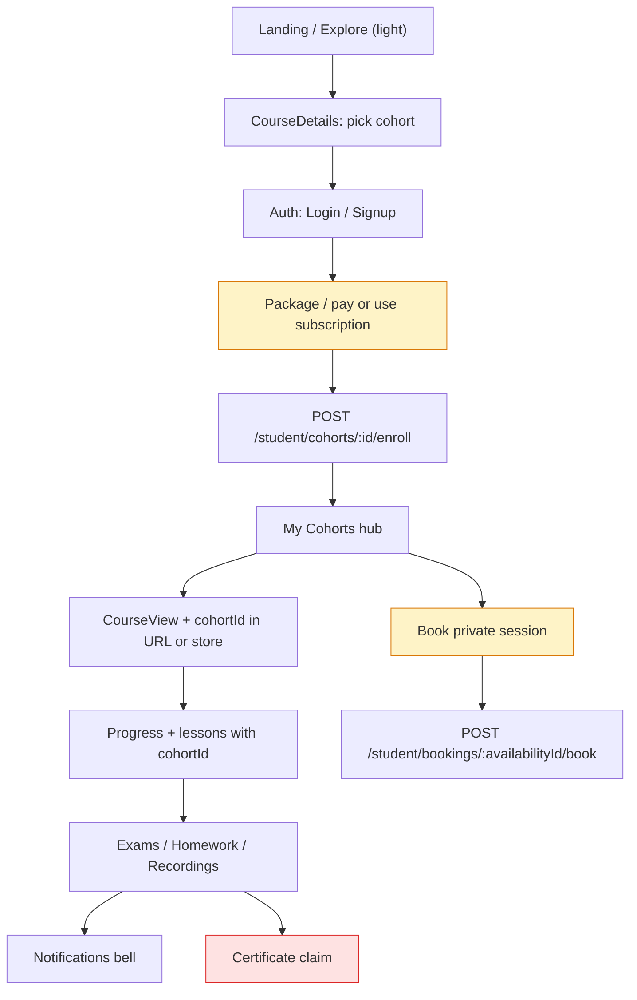
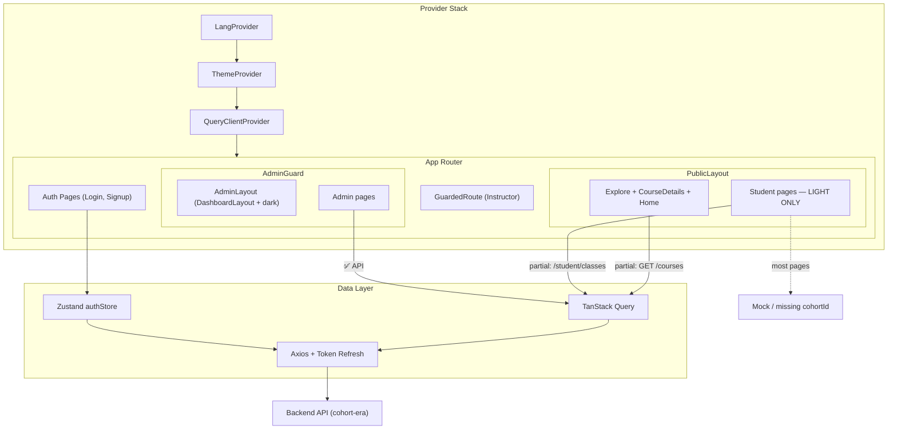

# NIHAO ACADEMY — FRONTEND AUDIT REPORT (Part 2/2)
## Tasks 3–4 + §4.6: Flows, Documentation, API/State Strategy (Cohort-era backlog)

> **Master plan refresh**: May 2, 2026 — aligned with backend: cohorts, packages/quotas, notifications, homework types, atomic booking.  
> **Global UX rules** (mobile-first Tailwind, i18n keys + RTL/LTR, dark mode **only** Admin + Instructor): see [nihao_frontend_audit_part1.md §0](./nihao_frontend_audit_part1.md).

---

# Task 3: Frontend Flows, Edge Cases & Error Handling

## 3.0 Area scan — what the frontend must build (mapped to `/frontend` today)

### 1) Public / guest (landing & explore) — **light mode only**

| Goal | Backend reality | Frontend gap |
|------|-----------------|--------------|
| Guest sees a **course** then **chooses a cohort** (name, dates, instructor, price, seats) | `GET /courses` and `GET /courses/:id` return `availableCohorts` (+ `_count.cohorts`) | **Explore**: fetches courses but **drops cohort data**; maps fake `price`, `duration`, `rating`. **CourseDetails**: **static mock** (`COURSE`, hardcoded links like `/course/hsk2`); no enrollment against a **cohortId**. |
| Optional: public packages | `GET /packages` (public routes) | **Subscription.jsx** still mock; no link from catalog to package tiers. |

**Sprint backlog**: Cohort picker section on `CourseDetails` + cohort summary cards on Explore (or “from $X” using min cohort price); wire `useParams` + `useQuery(['public','course',id])`; i18n all labels (`cohort.startDate`, `cohort.seats`, etc.); mobile-first card layout.

### 2) Student portal — **light mode only**

| Goal | Backend reality | Frontend gap |
|------|-----------------|--------------|
| **My Cohorts** (enrollments) | `GET /student/courses/my-courses` returns course + **`cohortId`**, `cohortName`, progress | No page; **MyClasses** = **`/student/classes`** (live sessions). Rename/split UX: **“My Cohorts”** (enrollments) vs **“Upcoming sessions”** (classes) vs **“Book private session”**. |
| **Course player** scoped to enrollment | Progress: `POST /student/progress/...` with **`cohortId` in body**; `GET .../cohorts/:cohortId/resume`, `/stats` | **CourseView** uses **`/course/:courseId`** only — must carry **`cohortId`** (route or query) and call cohort-scoped progress. |
| **Quota / package limits** | Operations return **403** when limits exceeded | No **global upgrade modal**, no **navbar quota chip**, no axios interceptor branch for quota code vs generic 403. |
| **Notifications** | `GET /notifications`, `PATCH .../read`, `PATCH .../read-all` | No bell in **Header** (student); dashboard Topbar dropdown is decorative. |
| **Private booking** | `POST /student/bookings/:availabilityId/book` | No calendar UI; **instructor availability** API is currently **POST create slot only** — **no documented GET** of open slots for students (contract gap: add public/instructor listing or document embedded query). |
| **Homework** | Types `TEXT` \| `FILE` \| `LINK`; submit `POST /homework/student/:id/submit` body `{ content?, fileUrl? }` | **Homework / HomeworkDetail** mock-only; UI must branch by `homework.type` (textarea / file upload+URL / URL field); **list endpoint** not in current homework router — may need backend `GET` by cohort or reuse another resource. |

### 3) Instructor dashboard — **dark mode allowed**

| Goal | Backend reality | Frontend gap |
|------|-----------------|--------------|
| **Availability calendar** | `POST /instructor/availability` `{ startTime, endTime }` | No page/route; need week/month calendar, slot creation, overlap validation UX. |
| **Homework grading queue** | `PATCH /homework/instructor/submissions/:id/grade` | No queue UI; create flows from cohort context. |
| **Cohort student progress** | Data via admin/instructor services (wallet, classes/cohorts) | **InstructorStudents** / overview may need tables keyed by **cohortId** + progress columns. |
| **Wallet / payout requests** | `/instructor/wallet` (existing hooks) | **Wallet.jsx** exists — verify payout request vs new admin payout approvals. |

### 4) Admin dashboard — **dark mode allowed**

| Goal | Backend reality | Frontend gap |
|------|-----------------|--------------|
| **Package / tier manager** | `GET/POST/PATCH/DELETE /admin/financials/packages` | **Finance.jsx** has package subscription creation — **dedicated CRUD UI** for limits/prices may be incomplete vs new schema fields. |
| **Cohort manager** | **`/admin/classes`** = cohort CRUD (naming legacy “classes”) | Admin UI must expose: assign instructor, dates, cohort **type**, status, capacity; align copy **“Cohort”** not ambiguous “class session”. |
| **Payout approvals** | `/admin/payouts` routes | **InstructorPayouts** page exists — confirm end-to-end with new service split. |
| **Manual enrollment** | Admin enrollments + subscriptions expect **`cohortId`** (or `courseId` fallback resolving latest cohort) | **EnrollStudent** flow must be **Course → pick Cohort → pick Student** (not course-only). |

### 5) State management & API layer — see **§4.6** (end of this file).

### 3.0.1 Backend route map (integration checklist)

| Domain | Prefix / routes (Express `apiRouter`) |
|--------|----------------------------------------|
| Public courses | `/courses`, `/courses/:id/reviews` |
| Public packages | `/packages` |
| Categories / instructors / certificates / CMS | `/categories`, `/instructors`, `/certificates`, `/public/...` |
| Student courses & content | `/student/courses` (`my-courses`, `:id/units`, `:id/exams`) |
| Student cohort enroll | `/student/cohorts/:id/enroll` |
| Student scheduled classes | `/student/classes` |
| Student progress | `/student/progress/...` (**`cohortId` in path or body**) |
| Student bookings | `/student/bookings/:availabilityId/book` |
| Student financials / coupons / wishlist / certs / QnA / reviews | under `/student/...` |
| Notifications (all roles) | `/notifications` |
| Homework | `/homework/instructor`, `/homework/student/:id/submit`, grade patch |
| Instructor availability | `POST /instructor/availability` |
| Instructor panel / classes / exams / wallet / QnA | `/instructor-panel/...`, `/instructor/...` |
| Admin cohorts (“classes”) | `/admin/classes` |
| Admin financials (packages, payments) | `/admin/financials/...` |
| Admin enrollments / subscriptions / payouts | `/admin/enrollments`, `/admin/subscriptions`, `/admin/payouts` |

---

## 3.1 User Flow Analysis

### Student journey — target (cohort-era) vs current wiring



**Current shortcuts / debt**: Explore omits cohorts; CourseDetails mock; no enforced student `GuardedRoute`; **403 quota** not handled; homework list APIs missing from router; notification APIs unused.

### Legacy diagram — mental model shift

| Old mental model | New mental model |
|------------------|------------------|
| “I bought a course” | “I am enrolled in a **cohort** of a course” |
| `MyClasses` = my learning | Split: **cohorts** (catalog progress) vs **scheduled classes** vs **private bookings** |
| `courseId` alone for player | **`cohortId` + courseId`** for authorization + progress APIs |

### 🔴 Critical missing / incomplete flows (cohort-era priority)

| # | Flow | Impact |
|---|------|--------|
| 1 | **Cohort-aware catalog & course page** | Guests/students cannot see **Available Cohorts** or enroll with real `cohortId`. |
| 2 | **My Cohorts + deep links** | `my-courses` API unused; no hub; **CourseView** cannot safely attach **cohortId** to progress APIs. |
| 3 | **Payment / package checkout + coupons** | No student checkout; **403 quota** and tier limits need UX (modal, CTA to upgrade package). |
| 4 | **Forgot Password Page** | Login still links `/forgot-password` — **404** if route not added. |
| 5 | **Certificate claim UI** | Still missing dedicated flow. |
| 6 | **Notification center (wired)** | `GET /notifications` etc. exist; **no Header bell + list + mark read** for students. |
| 7 | **Private session booking** | Atomic lock on backend; **no calendar** + possible **GET availability** gap for listing slots. |
| 8 | **Homework (TEXT/FILE/LINK)** | Submit path exists; **list/mine** endpoints may be missing — pages remain mock. |
| 9 | **Student support tickets** | No student-facing ticket UI. |
| 10 | **Admin: cohort CRUD + manual enroll** | Must mirror **`/admin/classes`** cohort model and **course → cohort → student** wizard. |

### 🟡 Quota & subscription limits (403) — planned UX

| Item | Description |
|------|-------------|
| **Axios / React Query** | Intercept `403` responses where payload indicates **quota/limit** (align with backend error shape); avoid blanket redirect to `/access-denied` for quota (treat as **soft gate**). |
| **Global upgrade modal** | Reusable modal: current package, limit hit, CTA to **Subscription** / checkout; i18n keys. |
| **Navbar / dashboard chip** | Show **remaining quota** (e.g. private sessions left, cohort enrollments) from student financials/subscription endpoint once wired — mobile-first, collapses to icon on small screens. |
| **Mutations** | Wrap `useMutation` on enroll, book, submit homework with `onError` → toast + modal when quota exceeded. |

### 🔴 Route/Page Mismatch

| Route in App.jsx | Page Exists? | Issue |
|-----------------|-------------|-------|
| `/course/:id` (CourseView) | ✅ | Mock curriculum; **no `cohortId`** — incompatible with `/student/progress` as implemented |
| `/courses/:id` (CourseDetails) | ✅ | Different from CourseView — confusing URL similarity |
| `/forgot-password` | ❌ | Linked from Login but route doesn't exist — **404** |
| `/admin/courses/:id` | ✅ | Maps to `AdminCourses` (list page), not a detail page — likely wrong |

### 🟡 Route Protection Gaps

Student-only pages like `/my-classes`, `/homework`, `/exams`, `/progress`, `/settings`, `/course/:id` are **not protected by any auth guard**. Any unauthenticated user can navigate to them directly:

```jsx
// App.jsx — inside <Layout> route, NO GuardedRoute wrapper
<Route path="/my-classes"   element={<MyClasses />} />
<Route path="/homework"     element={<Homework />} />
<Route path="/exams"        element={<Exams />} />
<Route path="/settings"     element={<Settings />} />
<Route path="/exams/:id/take" element={<TakeExam />} />
```

Only `/admin/*` and `/instructor/*` routes use `GuardedRoute`. Student pages assume authentication via the store but don't enforce it at the route level.

---

## 3.2 Form Validation Analysis

### ✅ Good: React Hook Form + Zod Pattern

The following pages correctly use the `useForm` + `zodResolver` pattern:

| Page | Schema | Feedback |
|------|--------|----------|
| Login | `loginSchema` | ✅ Field-level errors + server error banner |
| Signup | (likely `registerSchema`) | ✅ |
| Settings/Profile | `profileSchema` | ✅ Field-level errors |
| Settings/Security | `passwordSchema` with `.refine()` | ✅ Password match validation |

### 🟡 Validation Messages Use i18n Keys as Raw Strings

```javascript
const profileSchema = z.object({
  fullName: z.string().min(2, "settings.errors.fullNameMin"),  // ← This is a KEY, not a message
});
```

The error message rendered is the i18n key string (e.g., `settings.errors.fullNameMin`). This only works because the component does `t(errors.fullName.message)` to translate it. But if `t()` is accidentally omitted, the user sees a raw translation key.

### 🔴 No Validation on Exam Answers

TakeExam has no validation — a student can submit with zero answers selected. The confirmation modal shows the count but doesn't prevent empty submissions.

---

## 3.3 Error Handling

### ✅ API Error Extraction

[api/error.js](file:///f:/Nihao/frontend/src/api/error.js) provides `getErrorMessage()` which correctly extracts error messages from various API response shapes.

### 🔴 No Network-Offline Handling

No detection or UI feedback for:
- Network disconnection
- API server unavailability
- Timeout errors

The app will silently fail or show cryptic errors when offline.

### 🔴 403 Interceptor Uses `window.location.href`

```javascript
// lib/api.js line 29-31
if (error.response?.status === 403) {
  window.location.href = "/access-denied";  // ❌ Full page reload, breaks SPA
  return Promise.reject(error);
}
```

This triggers a full page reload instead of using React Router navigation. Use a navigation event or store action instead.

### 🟡 Settings Forms Use Fake API Calls

```javascript
// Settings.jsx — ProfileSection
const onSubmit = async () => {
  await new Promise((r) => setTimeout(r, 600));  // ❌ Fake delay, not API call
  setSaved(true);
};
```

---

## 3.4 Frontend Test Scenarios for QA

### AUTH FLOW

| # | Scenario | Type | Expected Result |
|---|----------|------|-----------------|
| F-A1 | Register with valid data | ✅ Happy | Redirect to home, auth state set |
| F-A2 | Register with existing email | ❌ Negative | Server error shown in banner |
| F-A3 | Register with mismatched passwords | ❌ Negative | Zod error shown below field |
| F-A4 | Login with valid credentials | ✅ Happy | Redirect to role-based landing |
| F-A5 | Login as Admin → redirected to /admin | ✅ Happy | Admin dashboard loads |
| F-A6 | Login with wrong password | ❌ Negative | Error banner appears |
| F-A7 | Login → close browser → reopen | ✅ Happy | Zustand persist restores session |
| F-A8 | Click "Forgot Password" link | ⚠️ Edge | **CURRENTLY 404** — page doesn't exist |
| F-A9 | Logout from dropdown | ✅ Happy | Tokens cleared, redirect to home |
| F-A10 | Access /admin as student | ❌ Negative | Redirect to /access-denied |
| F-A11 | Access /my-classes when not logged in | ⚠️ Edge | **NO REDIRECT** — page loads with empty data |
| F-A12 | Token expires during session | ⚠️ Edge | Auto-refresh via interceptor, transparent to user |
| F-A13 | Refresh token also expired | ⚠️ Edge | Redirect to /login, tokens cleared |

### NAVIGATION & LAYOUT

| # | Scenario | Type | Expected |
|---|----------|------|----------|
| F-N1 | Desktop: all nav links work | ✅ Happy | Correct pages load, active link highlighted |
| F-N2 | Mobile: hamburger menu opens/closes | ✅ Happy | Animated drawer, items clickable |
| F-N3 | User dropdown shows initials | ✅ Happy | First+Last initials shown |
| F-N4 | Language toggle EN → AR | ✅ Happy | Layout flips RTL, Arabic font applied |
| F-N5 | Language toggle AR → EN | ✅ Happy | Layout flips LTR |
| F-N6 | Dark mode toggle (admin/instructor) | ✅ Happy | Dashboard pages switch themes |
| F-N7 | Theme when navigating admin → public/student | ⚠️ Policy | **`dark` on `<html>` may leak** — public/student must **force light** per master plan §0.1 |
| F-N8 | Back button after login | ✅ Happy | Should not go back to login page |

### COURSE VIEW

| # | Scenario | Type | Expected |
|---|----------|------|----------|
| F-C1 | Open course → sidebar shows modules | ✅ Happy | Accordion modules, lessons listed |
| F-C2 | Click lesson → content changes | ✅ Happy | Animated transition, video placeholder |
| F-C3 | Mobile → hamburger opens sidebar drawer | ✅ Happy | Drawer slides in with overlay |
| F-C4 | Navigate Previous/Next lessons | ✅ Happy | Lesson content updates |
| F-C5 | Tab between Notes/Materials/Objectives | ✅ Happy | Animated tab transitions |
| F-C6 | Notes textarea editable | ✅ Happy | Text persists during session |
| F-C7 | Notes persistence across page navigation | ⚠️ Edge | **NOT SAVED** — notes are local state only |
| F-C8 | Download material button | ⚠️ Edge | **NON-FUNCTIONAL** — no download handler |

### EXAM FLOW

| # | Scenario | Type | Expected |
|---|----------|------|----------|
| F-E1 | Start exam → timer starts counting down | ✅ Happy | Timer shows in header strip |
| F-E2 | Select answer → option highlighted | ✅ Happy | Red border + radio fill |
| F-E3 | Navigate between questions | ✅ Happy | Animated slide transition |
| F-E4 | Question dots update (answered = green) | ✅ Happy | Visual feedback |
| F-E5 | Click Submit → confirmation modal | ✅ Happy | Shows answered/unanswered count |
| F-E6 | Confirm submit → results shown | ✅ Happy | Score, pass/fail, percentage |
| F-E7 | Timer reaches 0 → auto-submit | ✅ Happy | `handleFinish()` called automatically |
| F-E8 | Timer < 5 min → visual warning | ✅ Happy | Timer pulses red |
| F-E9 | Audio play button → progress bar | ✅ Happy | 4-second fake animation |
| F-E10 | Submit with 0 answers | ⚠️ Edge | **ALLOWED** — no minimum validation |
| F-E11 | Browser refresh mid-exam | ⚠️ Edge | **ALL PROGRESS LOST** — no persistence |
| F-E12 | Navigate away mid-exam | ⚠️ Edge | **NO WARNING** — `beforeunload` not set |
| F-E13 | View page source → see correct answers | 🔴 Security | **EXPOSED** — answers in JS bundle |

### SETTINGS

| # | Scenario | Type | Expected |
|---|----------|------|----------|
| F-S1 | Edit profile name → Save | ✅ Happy | Fake success, "Saved!" shown |
| F-S2 | Change password with matching fields | ✅ Happy | Fake success, form reset |
| F-S3 | Change password with mismatch | ❌ Negative | Zod error on confirm field |
| F-S4 | Toggle notification switches | ✅ Happy | Toggle animates, state updates |
| F-S5 | Save profile with empty name | ❌ Negative | "Min 2 characters" error |
| F-S6 | Email field is read-only | ✅ Happy | Cannot edit, grayed out |
| F-S7 | Profile changes persist after refresh | ⚠️ Edge | **NOT SAVED** — fake API call |

### ADMIN PANEL

| # | Scenario | Type | Expected |
|---|----------|------|----------|
| F-AD1 | Dashboard stats load | ✅ Happy | Cards show student/instructor/revenue counts |
| F-AD2 | Student list with pagination | ✅ Happy | Table renders, pages navigate |
| F-AD3 | Course editor saves | ✅ Happy | API call to backend |
| F-AD4 | Mobile sidebar toggles | ✅ Happy | Animated drawer with overlay |
| F-AD5 | Role-based route protection | ✅ Happy | Non-admin redirected to /access-denied |

### INTERNATIONALIZATION

| # | Scenario | Type | Expected |
|---|----------|------|----------|
| F-I1 | All visible text is translated (EN) | ✅ Happy | No raw keys visible |
| F-I2 | All visible text is translated (AR) | ⚠️ Edge | May have missing keys — needs audit |
| F-I3 | RTL layout mirrors correctly | ✅ Happy | Padding, icons, arrows flip |
| F-I4 | Language persists across refresh | ✅ Happy | localStorage checked on mount |
| F-I5 | Numbers/dates in Arabic locale | ⚠️ Edge | Not tested — may show English numbers |

---

## 3.5 Critical Edge Cases Summary

| # | Edge Case | Current Behavior | Fix Required |
|---|-----------|-------------------|-------------|
| 1 | Correct exam answers in JS bundle | Exposed to DevTools | 🔴 CRITICAL |
| 2 | /forgot-password → 404 | Broken link from Login | 🔴 CRITICAL |
| 3 | Student pages unprotected | Any visitor can access | 🔴 HIGH |
| 4 | Exam progress lost on refresh | All answers reset | 🟡 HIGH |
| 5 | No beforeunload warning on exam | User can accidentally navigate away | 🟡 HIGH |
| 6 | Settings profile save is fake | No API integration | 🟡 HIGH |
| 7 | Course notes not persisted | Lost on page change | 🟡 MEDIUM |
| 8 | Download buttons non-functional | Click does nothing | 🟡 MEDIUM |
| 9 | No offline detection | Silent failures | 🟡 MEDIUM |
| 10 | Global `dark` class affects public/student | Violates light-only policy | 🟡 HIGH (policy) |

---

# Task 4: Component & Page Directory Documentation (v1)

## 4.1 Project Structure

```
src/
├── App.jsx                    # Root router — all route definitions
├── main.jsx                   # Entry point — providers (Query, Theme, Lang, Toast)
├── index.css                  # Global styles, font imports, Tailwind layers
│
├── api/                       # API layer
│   ├── client.js              # Re-export of lib/api (redundant)
│   ├── endpoints.js           # Admin/instructor endpoint registry
│   └── error.js               # getErrorMessage(), unwrapResponse()
│
├── lib/                       # Core libraries
│   ├── api.js                 # Axios instance + interceptors (auth, refresh, 403)
│   └── permissions.js         # PERMISSION_GROUPS, ALL_PERMISSIONS constants
│
├── store/                     # Global state
│   └── authStore.js           # Zustand + persist — login, register, logout
│
├── contexts/                  # React contexts
│   ├── ThemeContext.tsx        # Dark/light mode toggle
│   └── LangContext.tsx        # EN/AR language with RTL/LTR switching
│
├── hooks/                     # Custom hooks
│   ├── useAuthGate.js         # Role-based access check
│   ├── usePaginatedQuery.js   # URL search params → { page, limit, search }
│   └── useTheme.js            # Theme hook (separate from context)
│
├── config/                    # Static configuration
│   ├── permissions.js         # APP_ROLES, normalizeRole(), hasAnyRole()
│   ├── dashboardNav.admin.js  # Admin sidebar navigation items
│   ├── dashboardNav.instructor.js
│   └── navigation.ts          # Public navigation structure
│
├── i18n/                      # Internationalization
│   ├── i18n.ts                # i18next config
│   └── locales/               # Translation JSON files (en, ar)
│
├── routes/                    # Route definitions
│   ├── adminRoutes.jsx        # /admin/* — 35 pages, GuardedRoute wrapper
│   ├── instructorRoutes.jsx   # /instructor/* — GuardedRoute wrapper
│   └── guardedRoute.jsx       # Auth + role checker component
│
├── layouts/                   # Layout shells
│   ├── AdminLayout.jsx        # → DashboardLayout with admin nav
│   ├── InstructorLayout.jsx   # → DashboardLayout with instructor nav
│   └── DashboardLayout.jsx    # Sidebar + Topbar + Outlet
│
├── components/                # Shared components
│   ├── Layout.jsx             # Header + main + Footer wrapper
│   ├── Header.jsx             # Main navbar (topbar + nav + user menu)
│   ├── Footer.jsx             # Site footer
│   ├── Hero.jsx               # Landing page hero section
│   ├── Features.jsx           # Landing page features grid
│   ├── CTA.jsx                # Call-to-action section
│   ├── Feedback.jsx           # Testimonials/reviews
│   ├── HowItWorks.jsx         # How it works steps
│   ├── LearningStyle.jsx      # Learning style showcase
│   ├── ui/                    # Atomic UI components
│   │   ├── DataTable.tsx      # Reusable table with columns/rows
│   │   ├── EmptyState.tsx     # No-data placeholder
│   │   ├── ConfirmDialog.tsx  # Confirmation modal
│   │   ├── PageHeader.tsx     # Page title + description
│   │   ├── StatusBadge.tsx    # Colored status pill
│   │   ├── StatsRow.tsx       # Dashboard stat cards
│   │   ├── FilterBar.tsx      # Search/filter toolbar
│   │   └── SlideOver.tsx      # Side drawer panel
│   ├── layout/                # Dashboard layout parts
│   │   └── Sidebar.jsx        # Dashboard sidebar navigation
│   └── dashboard/             # Dashboard-specific
│       └── Topbar.jsx         # Dashboard top bar
│
├── pages/                     # All page components
│   ├── (17 student pages)     # See Section 4.2
│   ├── admin/                 # 35 admin pages
│   ├── instructor/            # Instructor pages
│   └── dashboard/             # Dashboard pages
│
└── features/                  # Feature-specific logic
    ├── admin/                 # Admin feature hooks/services (14 subdirectories)
    └── instructor/            # Instructor feature hooks/services
```

---

## 4.2 Core Pages Documentation

### Public Pages

| Page | Route | Purpose | API Integration |
|------|-------|---------|----------------|
| `Home.jsx` | `/` | Landing page shell — renders Hero, Features, CTA, etc. | ❌ Static |
| `Explore.jsx` | `/explore` | Course catalog | ⚠️ **`GET /courses`** — real list but **ignores `availableCohorts`**; still fabricates price/rating/duration |
| `CourseDetails.jsx` | `/courses/:id` | Public course detail | ❌ **Mock data** — must fetch course by id + cohort picker |
| `Subscription.jsx` | `/subscription` | Package/pricing display | ❌ Mock data |
| `Login.jsx` | `/login` | Auth form with Zod validation | ✅ API via authStore |
| `Signup.jsx` | `/signup` | Registration form | ✅ API via authStore |
| `AccessDenied.jsx` | `/access-denied` | 403 fallback page | N/A |

### Student Pages (Auth Required — but NOT enforced)

| Page | Route | Purpose | API Integration |
|------|-------|---------|----------------|
| `MyClasses.jsx` | `/my-classes` | **Scheduled class sessions** (group/live) | ⚠️ **`GET /student/classes`** — not “My Cohorts”; still no cohort enrollment hub |
| `CourseView.jsx` | `/course/:id` | Lesson viewer (**course id only**) | ❌ Mock + **missing `cohortId`** for `/student/progress/...` |
| `Homework.jsx` | `/homework` | Homework list | ❌ Mock — **no list API** in current homework routes |
| `HomeworkDetail.jsx` | `/homework/:id` | Submission UI | ❌ Mock — must support **TEXT / FILE / LINK** + `POST /homework/student/:id/submit` |
| `Exams.jsx` | `/exams` | Exam list (available, completed) | ❌ Mock data |
| `ExamDetails.jsx` | `/exams/:id` | Exam info before starting | ❌ Mock data |
| `TakeExam.jsx` | `/exams/:id/take` | Live exam-taking with timer | ❌ Mock data |
| `Progress.jsx` | `/progress` | Course progress overview | ❌ Mock data |
| `Recordings.jsx` | `/recordings` | Class recording replays | ❌ Mock data |
| `Settings.jsx` | `/settings` | Profile, password, notifications | ❌ Fake API |

---

## 4.3 Shared UI Components

### `DataTable`

| Prop | Type | Default | Description |
|------|------|---------|-------------|
| `columns` | `Array<{ key, title, render? }>` | `[]` | Column definitions with optional custom renderer |
| `rows` | `Array<Record<string, any>>` | `[]` | Data rows |
| `pagination` | `ReactNode \| null` | `null` | Pagination component to render below table |
| `className` | `string` | `""` | Additional CSS classes |

**Behavior**: Renders a responsive table with horizontal scroll. Supports dark mode. Min-width 920px.

---

### `EmptyState`

| Prop | Type | Default | Description |
|------|------|---------|-------------|
| `title` | `string` | — | Main heading |
| `message` | `string` | — | Description text |
| `cta` | `ReactNode \| null` | `null` | Call-to-action button/link |
| `className` | `string` | `""` | Additional CSS classes |

**Behavior**: Centered card with circular icon placeholder, title, message, and optional CTA.

---

### `ConfirmDialog`

| Prop | Type | Description |
|------|------|-------------|
| `open` | `boolean` | Controls visibility |
| `title` | `string` | Dialog heading |
| `message` | `string` | Dialog body |
| `onConfirm` | `() => void` | Confirm callback |
| `onCancel` | `() => void` | Cancel callback |

---

### `StatusBadge`

| Prop | Type | Description |
|------|------|-------------|
| `status` | `string` | Status key (maps to color scheme) |
| `label` | `string` | Display text |

**Behavior**: Renders a colored pill. Colors mapped from status string.

---

### `PageHeader`

| Prop | Type | Description |
|------|------|-------------|
| `title` | `string` | Page title |
| `subtitle` | `string` | Description below title |

---

### `StatsRow`

| Prop | Type | Description |
|------|------|-------------|
| `stats` | `Array<{ label, value, icon?, color? }>` | Stat card definitions |

**Behavior**: Horizontal row of stat cards for dashboard overview.

---

### `SlideOver`

| Prop | Type | Description |
|------|------|-------------|
| `open` | `boolean` | Controls visibility |
| `onClose` | `() => void` | Close callback |
| `children` | `ReactNode` | Panel content |

**Behavior**: Right-side drawer panel with overlay backdrop.

---

### `FilterBar`

| Prop | Type | Description |
|------|------|-------------|
| `children` | `ReactNode` | Filter controls |

**Behavior**: Simple wrapper for filter/search toolbar.

---

## 4.4 Key Custom Hooks

### `useAuthGate(allowedRoles: string[])`
**Returns**: `{ isAuthenticated, user, isAllowed }`  
**Use**: Check if current user has any of the specified roles.

### `usePaginatedQuery(searchParams: URLSearchParams)`
**Returns**: `{ page, limit, search }`  
**Use**: Extract pagination parameters from URL search params.

---

## 4.5 Architecture Diagram (May 2026)



---

## 4.6 State management & API layer — `cohortId` everywhere (Task 5)

### 4.6.1 Principles

1. **Treat `cohortId` as a first-class route or session parameter** wherever the student is acting *as an enrolled learner*: progress, homework context, optional QnA, certificates. Keep `courseId` for catalog browsing and curriculum structure **after** enrollment is proven.
2. **URL shape (recommended for sprints)**  
   - Option A: `/learn/:cohortId/...` (player, homework, progress)  
   - Option B: `/course/:courseId?cohort=:cohortId` (shallower migration; validate cohort belongs to course on load)  
   Pick one and document in router; avoid silent mismatch (My Cohorts link opening wrong cohort).
3. **React Query keys** must include both ids when both apply, e.g. `['student','progress','cohort', cohortId]`, `['student','course', courseId, 'units', { cohortId }]`.

### 4.6.2 Suggested hook modules (feature folders)

| Module | Example `queryKey` roots | Notes |
|--------|-------------------------|-------|
| `features/public/courses` | `['public','courses']`, `['public','course', id]` | Map `availableCohorts` to typed UI models. |
| `features/student/cohorts` | `['student','cohorts']`, `['student','my-courses']` | Wrap `GET .../my-courses` + `POST /student/cohorts/:id/enroll`. |
| `features/student/classes` | `['student','classes']` | Live sessions grid (**already used by MyClasses**). |
| `features/student/progress` | `['student','progress', cohortId, ...]` | Resume + stats + lesson mutations with `cohortId` in body. |
| `features/student/bookings` | `['student','bookings']` | Mutation `book(availabilityId)`; queries depend on agreed listing API. |
| `features/student/notifications` | `['notifications']` | List + infinite scroll + invalidate on patch read. |
| `features/student/homework` | `['student','homework', cohortId]` or similar | Depends on backend list contract. |
| `features/admin/cohorts` | `['admin','cohorts']` | CRUD → `/admin/classes`. |

### 4.6.3 Zustand (`authStore` + optional UI stores)

| Store | Responsibility | Do **not** |
|-------|----------------|------------|
| **authStore** (existing) | User, tokens, roles | Duplicate `cohortId` long-term — prefer URL as source of truth for deep links |
| **Optional `enrollmentContextStore`** | Last-selected `cohortId` when jumping from My Cohorts → player | Replace server state; clear on logout |

### 4.6.4 `endpoints.js` expansion checklist

Mirror backend `apiRouter` groups at minimum: `/student/courses`, `/student/cohorts`, `/student/classes`, `/student/progress`, `/student/bookings`, `/student/financials`, `/notifications`, `/homework`, `/packages`, `/courses` (public), `/admin/financials/*`, `/admin/classes`, `/admin/enrollments`, `/instructor/availability`.

---

## 4.7 Final Verdict

| Task | Grade | Key Finding |
|------|-------|-------------|
| **Task 1: Architecture** | **D+** | Zero TypeScript on most pages, mock data on core student flows, no route-level code splitting |
| **Task 2: UI/UX** | **B** | Strong tokens + RTL; a11y weak; **dark mode must be scoped** to dashboards only |
| **Task 3: Flows** | **D+** | Cohort-era flows largely absent; forgot-password still broken; student routes unguarded; exam answers exposed |
| **Task 4: Documentation** | **B+** | Clear structure; admin feature folders are a good pattern to extend for student |
| **§4.6 API/state** | **N/A (planning)** | Backlog defined — `cohortId` in Query keys and URLs is mandatory |

### The bottom line

The **admin panel** remains ahead of the student app in API coverage. The backend is now **cohort-first**, but the frontend still presents a **course-first** and **mock-first** student experience. **Explore** partially integrated `GET /courses` but **does not surface cohorts** — the highest-leverage fix is **public course + cohort picker**, then **My Cohorts (`my-courses`) + CourseView with `cohortId`**, then notifications, quota UX, booking, and homework aligned to `HomeworkType`.

> [!IMPORTANT]
> **Estimated effort to cohort-v1 production** (indicative): **4–6+ weeks** depending on payment provider UI and any new read APIs (homework list, availability listing). Ordered priorities:
> 1. Cohort surfaces (Explore, CourseDetails, My Cohorts, CourseView route + progress hooks with `cohortId`)
> 2. Quota / package UX (403 handling, navbar chip, upgrade modal) + subscription/checkout pages
> 3. Notifications (Header bell + read state) — light-mode UI
> 4. Instructor availability + student booking calendar (resolve GET slots contract)
> 5. Homework TEXT/FILE/LINK + instructor grading queue
> 6. Admin cohort/package/enrollment UX alignment with `/admin/classes` and financials
> 7. TypeScript migration, route guards, error boundary, lazy routes (from Part 1)
